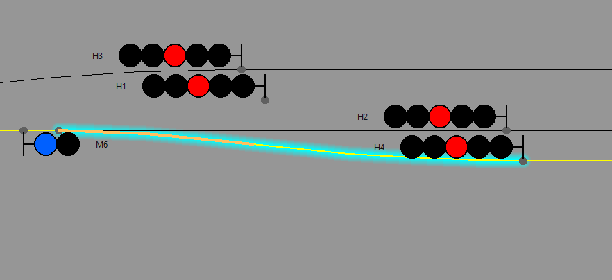
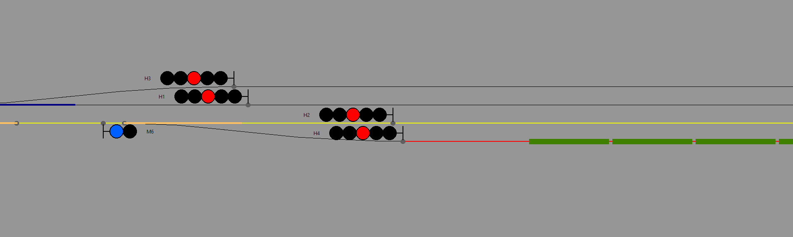

## 4. Продвинутые приемы разработки сценариев


То, что мы рассмотрели в предыдущих главах, касается базовых команд сценариев, выполняющих достаточно элементарные операции. Основываясь на этих знаниях, можно создавать достаточно сложные сценарии. Однако в полной мере возможности сценарного движка раскрываются при создании собственных функций.

Для этого необходимо более детальное погружение в алгоритмы работы сценариев в RRS.

### 4.1. Порядок выполнения скрипта сценария

Как выполняется скрипт сценария? Тот файл, что мы создавали на протяжении трех глав, main.lua загружаются при запуске игры и выполняется **полностью** от начала и до конца. Все записанные туда команды так или иначе воздействуют на движок игры, заставляя её выполнять определенные действия. Одни команды выполняются сразу же, другие - регистрируются симулятором и ждут своего часа. Разберем это подробнее.

1. Команды выполняемые при загрузке игры

Это все, что касается начальной инициализации поездки

* setTime, setDate, setDateTime - устанавливают дату при запуске игры
* setTrain - устанавливают заданный поезд в заданное место карты. Это тоже выполняется при запуске игры

Все остальные команды имеют отложенное действие.

2. Команды, выполняемые в процессе игры

Команды установки триггеров добавляют триггер в общий список триггеров, и в процессе исполнения игры происходит периодическая проверка всех триггеров на соответствие заданных триггером условий. При совпадении этих условий у какого то из триггеров (например наступление заданного момента времени) вызывает срабатывание action-функции, которую вы указали в качестве действия для этого триггера.

Временные триггеры, то есть те которые срабатывают на заданное время, проверяются периодически на каждом шаге симуляции. Сработавший триггер удаляется из списка.

Позиционные триггеры проверяются по наступлении события "изменение состояния траектории". То есть когда где-либо на карте происходит либо занятие, либо освобождение траектории. Данные триггеры могут удалятся после срабатывания, а могут оставаться в системе и срабатывать снова и снова. Существует доступный разработчику сценария механизм управления временем жизни триггера.

### 4.2. Создание собственной action-функции

В [приложении 2](appendix2.md) приведен список готовых action-функций, которые можно указывать в качестве действий для триггеров. Однако, этого функционала может нехватить, поэтому полезно научиться создавать свои action-функции.

Итак, action-функция - это функция на языке Lua. И выглядит она так

```
function my_action()

   -- Здесь пишем свою произвольную логику

end
```

Здесь:

* function - ключевое слово Lua, означающее начало описания функции
* my_action - имя функции, оно произвольное, но удовлетворяет ряду требований: латиница, не должно начинаться с цифры, не должно содержать пробелов, арифметических знаков, слешей, кавычек, скобок.
* () - в круглых скобках - список параметров, передаваемых в функцию. В данном примере нет параметров.
* end - ключевое слово, обозначающее конец тела функции.

Внутри функции можно описать произвольные действия, например вызвать системную функцию ([приложение 1](appendix1.md)) построения поездного маршрута

```
function my_action()

	buildTrainRoute("track_a_p2b", "track_a-b_nd-22", 1)

end
```

Теперь нашу action-функцию мы можем передать в тригер, например во временной


```
setTimeTrigger("17:30:10", my_action)
```

Полный текст сценария, содержащего эти действия, таков

```
-- Задаем время начала игры
setTime("17:30")

-- Описываем поезд игрока
my_train = TrainData.new()
my_train.name = "ВЛ60пк"
my_train.config = "vl60pk-1543"
my_train.traj = "track_a_p2b"
my_train.coord = 1690.0
my_train.dir = 1

-- Устанавливаем поезд игрока
setTrain(my_train)

-- Пользовательская action-функция
function my_action()

	buildTrainRoute("track_a_p2b", "track_a-b_nd-22", 1)

end

-- Ставим временной триггер с пользовательским action
setTimeTrigger("17:30:10", my_action)
```


То же самое действие, но с использованием стандартной action-функции actionBuildTrainRoute("track_a_p1a", "track_a-b_nd-22", 1) мы делали в [главе 2](scenario-struct.md), что гораздо быстрее и проще. В чем разница?

Разница в том, в нашей функции мы можем определить произвольные действия, например построить не один, а два маршрута

```
function my_action()

	-- Строим четный маршрут отправления
	buildTrainRoute("track_a_p2b", "track_a-b_nd-22", 1)

	-- Строим нечетный маршрут приема
	buildTrainRoute("track_a-b_n-1", "track_a_p5b", -1)

end
```

Видоизменив функцию мы получаем следующую картину


Логика работы нашей action-функций может быть произвольной. К сожалению, для полного овладения всеми возможностями, которые предоставляет данный механизм, придеться погрузиться в изучение языка Lua. Но некоторые вещи мы все же разберем здесь.

### 4.3. Передача параметров в action-функцию

В предыдущем примере мы сконструировали action-функции без параметров, а в вызываемые внутри системные функции передали конкретные имена траекторий и направления.

Однако, когда создается функция, обытно это подразумевает некотрые универсальные операции, выполняемые многократно.

Расмотрим такую задачку - поставить временной тригер на построение сквозного пропуска в друх направлениях для произвольной станции. Причем action-функция будет одна единественная, а триггеров мы поставим два - один для станции B, другой для станции C.

Для сквозного пропуска нам надо знать имена участков приближения и удаления для каждой станции в каждом направлении. Это мы, разумеется, выясним, но прежде напишем универсальную action-функцию строящую маршруты в двух направлениях.

```
-- Построение двух сквозных маршрутов пропуска
function dual_approach(traj_CHP1, traj_CHU1, traj_NP1, traj_NU1)

    -- Объявляем функцию БЕЗ параметров
    function action()

     -- Строим маршрут от траектории traj_CHP1 до traj_CHU1 в направлении 1
	 buildTrainRoute(traj_CHP1, traj_CHU1, 1)
	 -- Строим маршрут от траектории traj_NP1 до traj_NU1 в направлении -1
	 buildTrainRoute(traj_NP1, traj_NU1, -1)

    end

    -- Возвращаем функцию
    return action

end
```

Функция dual_approach будет строить два встречных сквозных маршрута по станции и она имеет четыре параметра. Параметры функции указываются в скобках, через запятую. Имена параметров подчиняются тем же правилам что и имена функций. Смысл данных параметров следующий

* traj_CHP1 - первый четный участок приближения (имя траектории)
* traj_CNU1 - первый четный участок удаления
* traj_NP1 - первый нечетный участок приближения
* traj_NU1 - первый нечетный участок удаления

Однако, видно, что внутри функции dual_approach у нас описана еще одна функция, без параметров. Делов втом, что движок игры, для универсальности органиизации таких функции полагает их функциями без параметров. Поэтому нам нужна внешняя функция, с параметрами - именами участков приближения и удаления, и внутренняя функция, без параметров, которая вызовет системные функции построения маршрута, передав им параметры внешней функции.

обратите внимание на эту строку

```
	-- Возвращаем функцию
	return action
```

Ключевое слово return означает, что функция возвращает некоторое значение, результат своей работы, который может быть использован в дальнейшем. В данном случае мы возвращаем *функцию*. Внутри функции dual_approach мы конструируем action-функцию, используем для её логики переданные параметры, а потом возвращаем эту функцию как результат работы.

А далее мы пишем вот так

```
setTimeTrigger("17:30:20", dual_approach("track_a-b_2-ch", "track_b-c_nd-22", "track_b-c_n-1", "track_a-b_21-chd"))
```

Ставим триггер на время 17:30:20, а вкачестве action-функции передаем результат работы функции dual_approach, которая создает action-функцию для триггера с нужными нам параметрами.

В данном случае в 17:30:20 будут построены два сквозных маршрута по станции B. Если мы хотим проделать то же самое и для станции C, поставим еще один триггер

```
setTimeTrigger("17:30:20", dual_approach("track_b-c_2-ch", "track_c_m3-nd", "track_c_m1-n", "track_b-c_21-chd"))
```

Здесь мы изменили только имена участков приближения и удаления, остальная логика осталась неизменной.

Такой механизм, когда мы конструируем функцию "на ходу", предаем её для использования другой функции, и при этом она может выполнится не прямо сейчас, а гораздо позже, по наступлению определенного события, носит названия механизма анонимных функций, или "лямбда"-функций. Такой подход широго используется в скриптовом языке Lua, движок сценариев RRS активное его эксплуатирует.

### 4.4. Триггеры, устанавливающие триггеры, устанавливающие триггеры...

С помощью action-функций можно добиться того, что, например установленный нами триггер на одно событие, может сам установить триггер, уже на другое событие. Это позволяет создать в сценарии цепочку взаимосвязанных друг с другом действий, не обзязательно четко привязанных к конкретному времени.

Например, рассмотрим такую ситуацию. На перегоне, по направлению к станции В, один за другим следуют два поезда. Первый поезд мы принимаем на боковой путь, а второму - организуем сквозной пропуск. Затем, когда второй поезд проследует по станции В, нам надо отправить первый поезд по удалению за вторым. То есть мы ставим первый поезд под обгон вторым, а все операции по построению маршрутов хотим возложить на сценарий.

Первым вариантом решения такой задачи могло бы быть создание временны́х триггеров, которые отработают последовательно на построение маршрутов. Но кто дает гарантию, что мы угадаем моменты времени, когда следует строить тот или другой маршрут? Разумеется, поезда должны следовать по графику и определенные временны́е рамки всех перечисленных операций у нас имеются. Но мы не можем и не должны полагаться на это! В реальной жизни, дежурный по станции готовит маршруты поезда прежде всего исходя из свободности и занятости участков станции, а соблюдение графика складывается в целом из его грамотных действий и грамотной работы машинистов поездов.

Поэтому мы воспользуемся позиционными триггерами. Пока попробуем обойтись стандартными триггерами ([приложение 3](appendix3.md)) и собственными action-функциями, там, где это действительно требуется.

Итак, создадим два пасcажирских поезда, для ускорения демонстрации примера расположим их на перегоне, на достаточном удалении друг от друга, так, чтобы их разделяло два блок-участка. Первый поезд поставим перед вторым участком приближения к станции В с четного направления.

```
-- Устанавливаем поезд 1
train1 = TrainData.new()
train1.name = "1"
train1.config = "vl60pk-1543-T65_17"
train1.traj = "track_a-b_6-4"
train1.coord = 1900.0
train1.dir = 1

setTrain(train1)

-- Устанавливаем поезд 3
train3 = TrainData.new()
train3.name = "3"
train3.config = "vl60pk-1543-T65_17"
train3.traj = "track_a-b_12-10"
train3.coord = 1900.0
train3.dir = 1

setTrain(train3)
```

Первый поезд мы принимаем на 4 путь. Маршрут ему надо построить, когда он вступит на второй участок приближения к станции В с четного направления. Имя траектории, которая является этим участком, мы можем определить из карты, но для удобства запишем его в переменную

```
-- Второй участок приближения к станции В
local stB_CHP2 = "track_a-b_4-2"
```

Это имя мы будем использовать несколько раз, поэтому его удобно записать в локальную переменную с именем stB_CHP2. Ключевое слово local означает что данная переменная видна только внутри скрипта main.lua.

Заведем переменные для других траекторий, занятие и освобождение которых мы будем отслеживать. Они же будут участвовать в построении маршрутов. То есть, опять таки удобно объявить эти имена как переменные

```
-- Первый участок удаления от станции В
local stB_CHU1 = "track_b-c_nd-22"
-- Второй участок удаления от станции В
local stB_CHU2 = "track_b-c_22-20"
-- 4 путь станции В
local stB_p4 = "track_b_p4"
-- Стрелочный участок от стрелки 12 до 4 пути станции В
local sw12_H4 = "track_b_12-p4"
```

Построим маршрут приема для поезда 1, по факту его вступления на второй участок приближения

```
-- Строим маршрут приема поезду 1 на 4 путь станции В
setOnTrajBusyTrigger(stB_CHP2, actionBuildTrainRoute(stB_CHP2, stB_p4, train1.dir))
```

Используем стандартный триггер, срабатывающий по занятию указанной траектории, и стандартный action построения поездного маршрута, от второго участка приближения, до 4 пути. Вместо конкретных названий траекторий используем *переменные* в которых хранятся данные имена.

Когда нам следует построить маршрут для поезда 3? Тогда, когда это станет возможным, а именно когда поезд 1 не будет уже занимать необходимые для построения этого маршрута стрелки. Например, когда поезд 1 полностью заедет на 4 путь, а значит он освободит стрелочный участок, примыкающий к этому пути, то есть траекторию, показанную на рисунке



Имя этой траектории мы записали в переменную sw12_H4. По факту её освобожения мы можем построить маршрут пропуска поезду 3, например так

```
setOnTrajFreeTrigger(sw12_H4, actionBuildTrainRoute(stB_CHP2, stB_CHU1, train3.dir))
```

При текущем расположении поездов это безусловно сработает - как только поезд 1 освободит стрелочный участок, заехав на 4 путь маршрут поезду 3 будет построен.



Но что если дистанция между поездами будет другой? Если поезда будут ближе друг к другу, вплоть до ситуации когда они занимают два подряд блок участка, работа сигнализации на перегоне не даст им сблизиться на дистанцию менее длины одного блок участка. Но все равно, чтобы избежать ситуации блокировки построения маршрута приема/пропуска, лучше строить его не от второго, а от первого участка приближения

```
-- Первый участок приближения к станции В
local stB_CHP1 = "track_a-b_2-ch"
```

и для маршрутов перепишем триггеры

```
-- Строим маршрут приема поезду 1 на 4 путь станции В
setOnTrajBusyTrigger(stB_CHP2, actionBuildTrainRoute(stB_CHP1, stB_p4, train1.dir))

-- Строим маршрут пропуска поезду 3
setOnTrajFreeTrigger(sw12_H4, actionBuildTrainRoute(stB_CHP1, stB_CHU1, train3.dir))
```

Если расстояние между поездами будет более значительным, может пройти достаточно большое время, прежде чем потребуется маршрут пропуска для поезда 3. И если мы построим маршрут сразу, то главный путь и все сопряженные с ним участки станции будут заняты, до тех пор, пока поезд 3 не будет пропущен по маршруту. Поэтому лучше, в данной ситуации, строить маршрут поезду 3 так же как и для поезда 1 - по факту занятия им второго участка приближения. А для этого нам нужно установить триггер на построение этого маршрута уже после того, как поезд 1 освободит стрелочный участок. Напишем для этого собственную action-функцию

```
-- Действия, выполняемые при освобождении поездом 1 стрелочного участка 12 - путь 4
function set_appr_train3()

	-- Строим маршрут пропуска поезду 3
	setOnTrajBusyTrigger(stB_CHP2, actionBuildTrainRoute(stB_CHP1, stB_CHU1, train3.dir))

end
```

Эта функция выполняет операцию установки нового позиционного триггера на занятие второго участка приближения, но уже с построеним сквозного маршрута для поезда 3. Эту функцию мы подставим в качестве action для триггера на освобождение стрелочного участка перед 4 путем

```
setOnTrajFreeTrigger(sw12_H4, set_appr_train3)
```

Теперь, при освобождении стрелочного участка маршрута не будет строиться маршрут пропуска, а будет установлен триггер, который сработает при занятии поездом 3 второго участка приближения и построит ему маршрут.

И наконец, чтобы завершить обгон, нам надо построить маршрут поезду 1. Мы сможем это сделать, когда поезд 3 покинет хотя бы первый, а лучше - второй участок удаления. Делаем эту операцию, путем установки позиционного триггера на освобождение второго участка удаления

```
-- Строим маршрут отправления поезду 1 с 4 пути, когда освободится второй участок удаления
setOnTrajFreeTrigger(stB_CHU2, actionBuildTrainRoute(stB_p4, stB_CHU1, train1.dir))
```

И, на этом примере, продемонстрируем еще один временно́й триггер, устанавливаемый функцией setPostEventTimeTrigger() (см. [приложение 1](appendix1.md))

Этот триггер срабатывает по времени, *через промежуток времени, прошедший с момента его установки*.

Например, мы хотим построить маршрут отправления поезду 1 не сразу после того как поезд 3 освободит второй участок удаления, а через 1 минуту 20 секунд после этого. Для этого создадим свою action-функцию

```
-- Действия, выполняемые после освобождения поездом 3 второго участка удаления
function set_dep_train1()

	-- Строим маршрут отправления поезду 1 через 1 минуту 20 секунд после освобождения ЧУ2
	setPostEventTimeTrigger("+00:01:20", actionBuildTrainRoute(stB_p4, stB_CHU1, train1.dir))

end
```

и устанавливаем её в качестве действия на триггер освобождения второго участка удаления

```
setOnTrajFreeTrigger(stB_CHU2, set_dep_train1)
```

Таким образом, при использовании собственных action-функций можно комбинировать различные триггеры, устанавливая их в том числе и каскадно, создавая достаточно сложные цепочки событий и действий по управлению движением из сценария.

### 4.5. Внутренняя организация позиционного триггера. Функция триггера. Время жизни позиционного триггера.

Те позиционные триггеры, о которых мы до сих пор говорили, описанные в [приложении 3](appendix3.md), являются стандартными и обрабатывают типовые ситуации. Эти триггеры работают поверх системного слоя симулятора, реализованы на языке Lua, а их реализацию можно увидеть в файле [modules/lua/triggers_fabric.lua](https://github.com/maisvendoo/RRS/blob/v1.9.0-devel/lua/triggers_fabric.lua). В него не возбраняется заглянуть и увидеть, что реализация достаточно сложная. Возьмем для примера функцию setOnTrajFreeTrigger()

```
--------------------------------------------------------------------------------
-- Занятие траектории произвольным поездом
--------------------------------------------------------------------------------
function setOnTrajBusyTrigger(name_traj, action)


	function on_busy_trigger_func(train_name, traj_name, is_busy)

		if is_busy and traj_name == name_traj then

			action()

			return TRIG_DELETE
		end

		return TRIG_SAFE
	end

	setTrigger(on_busy_trigger_func)
end
```

Напомню, что setOnTrajFreeTrigger - это функция, которая устанавливает триггер (событие), срабатывающий при занятии заданной траектории произвольным поездом. В эту функцию передается два параметра: имя траектории (name_traj), занятие которой проверяется, и функция, которая должна при этом выполниться (action).

Внутри реализации описана еще одна функция

```
	function on_busy_trigger_func(train_name, traj_name, is_busy)

		if is_busy and traj_name == name_traj then

			action()

			return TRIG_DELETE
		end

		return TRIG_SAFE
	end
```

Это - так называемая *функция позиционного триггера*. Она может иметь любое разрешенное имя, но имеет четкий список параметров, порядок которых нельзя нарушать

* train_name - имя поезда занявшего или освободившего траекторию
* traj_name - имя траектории, которая была занята или совобождена
* is_busy - сотояние занятости траектории: true - занята, false - свободна

Каждый раз, когда в процессе игры происходит изменение состояния какой-либо траектории, движок симулятора обращается к списку позиционных триггеров, за каждым из которых закреплена такая вот функция. Симулятор вызывает эти функции по очереди и в *каждую из них* передает имя поезда, изменившего состояние траектории, имя траектории, которая поменяла свое состояние, и то состояние (is_busy), которая она получила.

То есть сам симулятор вызывает эту функцию и передает туда перечисленную информацию. И дальше дело за разработчиком, как использовать её.

В данном примере стандартного триггера происходит проверка **одновременного выполнения** двух условий

* траектория была занята (is_busy - истинно)
* имя занятой траектории совпадает с той, что мы передали в функцию установки триггера (traj_name == name_traj)

В случае, если оба условия выполнились, значит наступило то событие, которое мы ожидаем, и тогда выполняется функция action(), которая, как мы видели выше, может содержать произвольную последовательность действий. После этого следует выход из функции, с передачей симулятору кода выхода TRIG_DELETE

```
return TRIG_DELETE
```

Симулятор, приняв код выхода TRIG_DELETE понимает, что данный триггер больше не нужен и удаляет его из списка обрабатываемых триггеров.

Если хотя бы одно из этих условий неверно, функция action() не исполняется. И мы выходим из функции, передав симулятору другой код выхода - TRIG_SAFE, что указывает на то, что триггер следует сохранить в списке. В этом случае он будет проверяться на срабатывание снова и снова, при каждом изменении состояния траекторий в игре.

Операция возврата кода выхода - обязательна при реализации функции триггера. Симулятор ожидает получить указание о том, что делать с триггером, после того как будет вызвана и отработает данная функция. Таким способом, логика внутри триггерной функции может управлять временем жизни позиционного триггера.

В конце функции setOnTrajBusyTrigger содержится вызов

```
setTrigger(on_busy_trigger_func)
```

setTrigger - это системная функция (см. [приложение 1](appendix1.md)) установки позиционного триггера. В качестве единственного параметра она принимает функцию триггера, в данном случае это функция on_busy_trigger_func, определенная выше. Это явное указание симулятору добавить данный триггер в список контролируемых позиционных триггеров.

**ВАЖНО!!!** Функция позиционного триггера имеет строго определенный формат!

```
function pos_trig_func(train_name, traj_name, is_busy)

	-- Здесь пишем произвольную логику, которая может использовать
	-- параметры train_name, traj_name, is_busy, получаемые от симулятора

	return TRIG_SAFE

end
```

Эта функция обязательно имеет три параметра: имя поезда, имя траектории, состояние, которое приняла траектория. Именно в этом порядке!

Эта функция обязательно должна возвращать симулятору код выхода!

Для установки позиционного триггера, обрабатываемого через данную функцию, обязательно выполняем вызов

```
setTrigger(pos_trig_func)
```

Это - еще один инструмент расширения функциональности движка сценариев. Да, предусмотрены стандартные триггеры на занятие/освобождение траекторий (см. [приложение 3](appendix3.md)). Возможно, по результатам опробования системы сценариев пользователями, данный список будет расширен. Однако, все возможные ситуации предусмотреть нереально.

Ниже я приведу пример того, как это можно использовать на практике. Но предварительно мы рассмотрим один небольшой вопрос.

### 4.6. Некоторые сервисные функции, предоставляемые игрой

Допустим, наша логика предусматривает необходимость проверки состояния какого-либо участка станции или перегона, и от этого будет зависеть то, как будет работать сценарий дальше. Для получения состояния траектории в любой момент предусмотрена системная функция getTrajState (см. [приложение 1](appendix1.md)). Эта функция принимает на вход имя траектории и возвращает состояние этой траектории в данный момент.

Пример использования

```
local traj_state = getTrajState("track_a_p1a")
```

Данная конструкция проверит состояние траектории с именем "track_a_p1a" и запишет его в переменную traj_state. Переменная traj_state является *структурой* и содержит два параметра

* is_busy - признак того, что траектория занята (true - занято, false - свободно)
* in_route - признак того, что данная траектория включена в уже построенный маршрут

Дальнейшее использование результата работы этой функции предусматривает применение условий, например

```
-- Проверяем занятость траектории
if traj_state.is_busy then

	-- Действия, которые мы предпримем если траектория занята

end

-- Проверяем включение траектории в маршрут
if traj_state.in_route then

	-- Действия, котоые мы предпримем, если траектория включена в маршрут

end
```


Еще одна функция, которая может быть полезна - getNextTraj. Она принимает два параметра - имя траектории и направление (1 или -1) и возвращает имя траектории, которая следует за данной траекторией в указанном направлении. Если траектория в заданном направлении оканчивается стрелкой, то вернется имя той траектории, на которую переключена стрелка в данный момент.

Пример использования:

```
local next_traj = getNextTraj("track_a_p1a", 1)
```

в переменную next_traj будет записано имя траектории, которая следует за траекторией "track_a_p1a" в направлении 1 ("туда").

