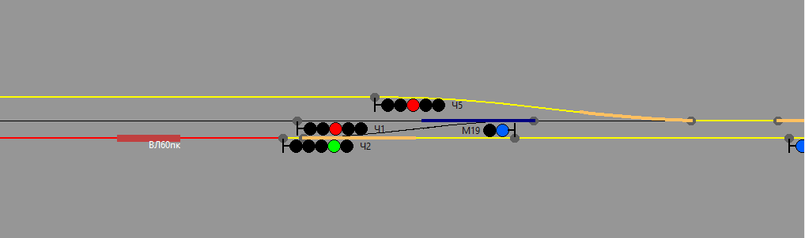

## 4. Продвинутые приемы разработки сценариев


То, что мы рассмотрели в предыдущих главах, касается базовых команд сценариев, выполняющих достаточно элементарные операции. Основываясь на этих знаниях, можно создавать достаточно сложные сценарии. Однако в полной мере возможности сценарного движка раскрываются при создании собственных функций.

Для этого необходимо более детальное погружение в алгоритмы работы сценариев в RRS.

### 4.1. Порядок выполнения скрипта сценария

Как выполняется скрипт сценария? Тот файл, что мы создавали на протяжении трех глав, main.lua загружаются при запуске игры и выполняется **полностью** от начала и до конца. Все записанные туда команды так или иначе воздействуют на движок игры, заставляя её выполнять определенные действия. Одни команды выполняются сразу же, другие - регистрируются симулятором и ждут своего часа. Разберем это подробнее.

1. Команды выполняемые при загрузке игры

Это все, что касается начальной инициализации поездки

* setTime, setDate, setDateTime - устанавливают дату при запуске игры
* setTrain - устанавливают заданный поезд в заданное место карты. Это тоже выполняется при запуске игры

Все остальные команды имеют отложенное действие.

2. Команды, выполняемые в процессе игры

Команды установки триггеров добавляют триггер в общий список триггеров, и в процессе исполнения игры происходит периодическая проверка всех триггеров на соответствие заданных триггером условий. При совпадении этих условий у какого то из триггеров (например наступление заданного момента времени) вызывает срабатывание action-функции, которую вы указали в качестве действия для этого триггера.

Временные триггеры, то есть те которые срабатывают на заданное время, проверяются периодически на каждом шаге симуляции. Сработавший триггер удаляется из списка.

Позиционные триггеры проверяются по наступлении события "изменение состояния траектории". То есть когда где-либо на карте происходит либо занятие, либо освобождение траектории. Данные триггеры могут удалятся после срабатывания, а могут оставаться в системе и срабатывать снова и снова. Существует доступный разработчику сценария механизм управления временем жизни триггера.

### 4.2. Создание собственной action-функции

В [приложении 2](appendix2.md) приведен список готовых action-функций, которые можно указывать в качестве действий для триггеров. Однако, этого функционала может не хватить, поэтому полезно научиться создавать свои action-функции.

Итак, action-функция - это функция на языке Lua. И выглядит она так

```
function my_action()

   -- Здесь пишем свою произвольную логику

end
```

Здесь:

* function - ключевое слово Lua, означающее начало описания функции
* my_action - имя функции, оно произвольное, но удовлетворяет ряду требований: латиница, не должно начинаться с цифры, не должно содержать пробелов, арифметических знаков, слешей, кавычек, скобок.
* () - в круглых скобках - список параметров, передаваемых в функцию. В данном примере нет параметров.
* end - ключевое слово, обозначающее конец тела функции.

Внутри функции можно описать произвольные действия, например вызвать системную функцию ([приложение 1](appendix1.md)) построения поездного маршрута

```
function my_action()

	buildTrainRoute("track_a_p2b", "track_a-b_nd-22", 1)

end
```

Теперь нашу action-функцию мы можем передать в триггер, например во временно́й


```
setTimeTrigger("17:30:10", my_action)
```

Полный текст сценария, содержащего эти действия, таков

```
-- Задаем время начала игры
setTime("17:30")

-- Описываем поезд игрока
my_train = TrainData.new()
my_train.name = "ВЛ60пк"
my_train.config = "vl60pk-1543"
my_train.traj = "track_a_p2b"
my_train.coord = 1690.0
my_train.dir = 1

-- Устанавливаем поезд игрока
setTrain(my_train)

-- Пользовательская action-функция
function my_action()

	buildTrainRoute("track_a_p2b", "track_a-b_nd-22", 1)

end

-- Ставим временно́й триггер с пользовательским action
setTimeTrigger("17:30:10", my_action)
```


То же самое действие, но с использованием стандартной action-функции actionBuildTrainRoute("track_a_p1a", "track_a-b_nd-22", 1) мы делали в [главе 2](scenario-struct.md), что гораздо быстрее и проще. В чем разница?

Разница в том, что в нашей функции мы можем построить не один, а два маршрута, например вот так

```
function my_action()

	-- Строим четный маршрут отправления
	buildTrainRoute("track_a_p2b", "track_a-b_nd-22", 1)

	-- Строим нечетный маршрут приема
	buildTrainRoute("track_a-b_n-1", "track_a_p5b", -1)

end
```

Видоизменив функцию, мы получаем следующую картину



Соотвественно, логика работы нашей action-функций может быть произвольной. К сожалению, для полного овладения всеми возможностями, которые предоставляет данный механизм, придется погрузиться в изучение языка Lua. Но некоторые вещи мы все же разберем здесь.

### 4.3. Передача параметров в action-функцию

В предыдущем примере мы сконструировали action-функции без параметров, а в вызываемые внутри системные функции передали конкретные имена траекторий и направления.

Однако, когда создается функция, обытно это подразумевает некотрые универсальные операции, выполняемые многократно.

Расмотрим такую задачку - поставить временной тригер на построение сквозного пропуска в друх направлениях для произвольной станции. Причем action-функция будет одна единественная, а триггеров мы поставим два - один для станции B, другой для станции C.

Для сквозного пропуска нам надо знать имена участков приближения и удаления для каждой станции в каждом направлении. Это мы, разумеется, выясним, но прежде напишем универсальную action-функцию строящую маршруты в двух направлениях.

```
-- Построение двух сквозных маршрутов пропуска
function dual_approach(traj_CHP1, traj_CHU1, traj_NP1, traj_NU1)

    -- Объявляем функцию БЕЗ параметров
    function action()

    	-- Строим маршрут от траектории traj_CHP1 до traj_CHU1 в направлении 1
		buildTrainRoute(traj_CHP1, traj_CHU1, 1)
		-- Строим маршрут от траектории traj_NP1 до traj_NU1 в направлении -1
		buildTrainRoute(traj_NP1, traj_NU1, -1)

	end

	-- Возвращаем функцию
	return action

end
```

Функция dual_approach будет строить два встречных сквозных маршрута по станции и она имеет четыре параметра. Параметры функции указываются в скобках, через запятую. Имена параметров подчиняются тем же правилам что и имена функций. Смысл данных параметров следующий

* traj_CHP1 - первый четный участок приближения (имя траектории)
* traj_CNU1 - первый четный участок удаления
* traj_NP1 - первый нечетный участок приближения
* traj_NU1 - первый нечетный участок удаления

Однако, видно, что внутри функции dual_approach у нас описана еще одна функция, без параметров. Делов втом, что движок игры, для универсальности органиизации таких функции полагает их функциями без параметров. Поэтому нам нужна внешняя функция, с параметрами - именами участков приближения и удаления, и внутренняя функция, без параметров, которая вызовет системные функции построения маршрута, передав им параметры внешней функции.

обратите внимание на эту строку

```
	-- Возвращаем функцию
	return action
```

Ключевое слово return означает, что функция возвращает некоторое значение, результат своей работы, который может быть использован в дальнейшем. В данном случае мы возвращаем *функцию*. Внутри функции dual_approach мы конструируем action-функцию, используем для её логики переданные параметры, а потом возвращаем эту функцию как результат работы.

А далее мы пишем вот так

```
setTimeTrigger("17:30:20", dual_approach("track_a-b_2-ch", "track_b-c_nd-22", "track_b-c_n-1", "track_a-b_21-chd"))
```

Ставим триггер на время 17:30:20, а вкачестве action-функции передаем результат работы функции dual_approach, которая создает action-функцию для триггера с нужными нам параметрами.

В данном случае в 17:30:20 будут построены два сквозных маршрута по станции B. Если мы хотим проделать то же самое и для станции C, поставим еще один триггер

```
setTimeTrigger("17:30:20", dual_approach("track_b-c_2-ch", "track_c_m3-nd", "track_c_m1-n", "track_b-c_21-chd"))
```

Здесь мы изменили только имена участков приближения и удаления, остальная логика осталась неизменной.
