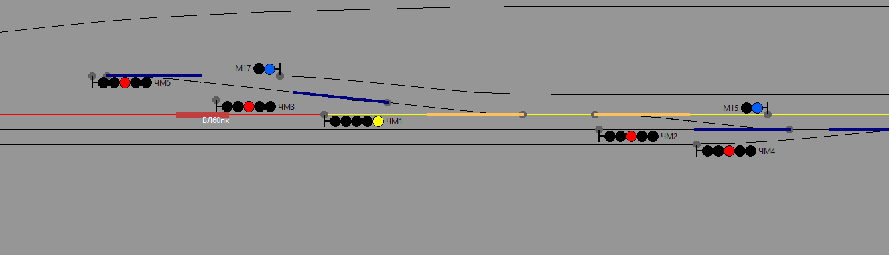
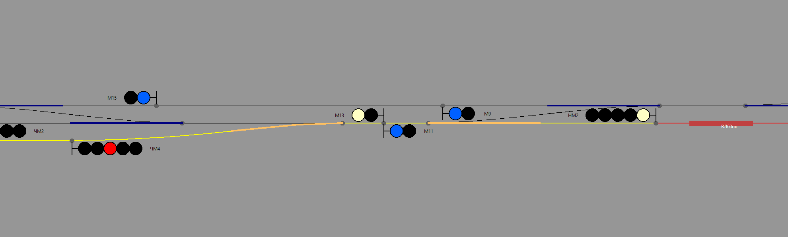
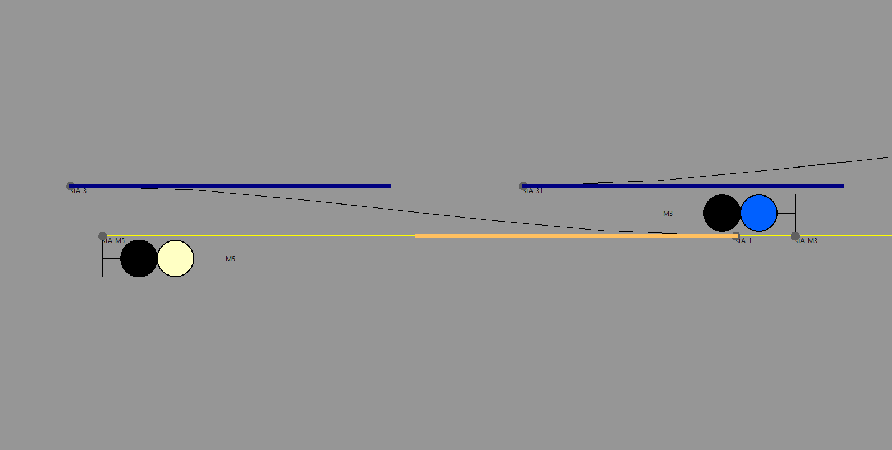
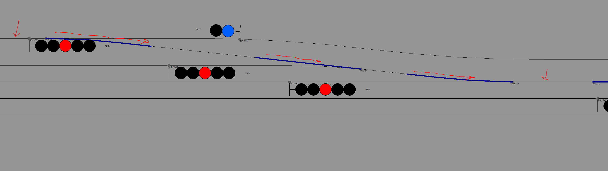
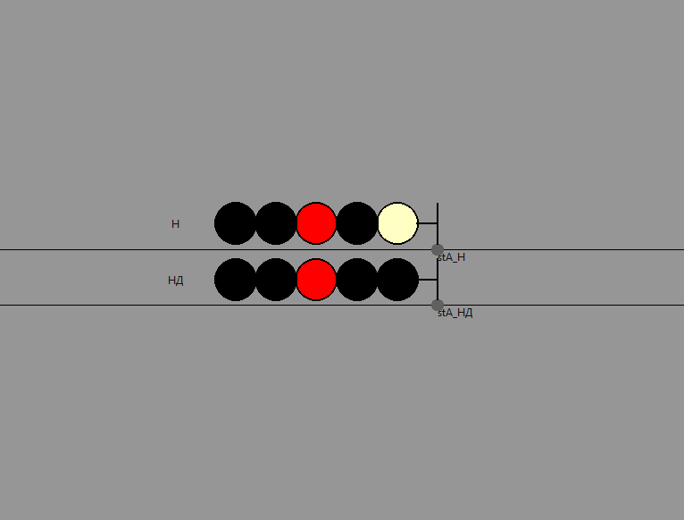

## Приложение 2. Перечень action-функций для подстановки в триггеры

|Функция|Параметры|Описание|
|---|---|---|
|actionBuildTrainRoute|"начальная траектория", "конечная траектория", направление (1 - туда, -1 - обратно)|Построение поездного маршрута от начальной до конечной траектории в заданном направлении. Автоматическая установка стрелок по маршруту и открытие всех попутных поездных сигналов. Маршрут подсвечивается в карте желтой линией|
|actionBuildShuntingRoute|"начальная траектория", "конечная траектория", направление (1 - туда, -1 - обратно)|Построение маневрового маршрута от начальной до конечной траектории в заданном направлении. Автоматическая установка стрелок по маршруту и открытие всех попутных маневровых сигналов. Маршрут подсвечивается в карте желтой линией|
|actionSetSwitchsAlongRoute|"начальная траектория", "конечная траектория", направление (1 - туда, -1 - обратно)|Устанавливает стрелки по маршруту от начальной до конечной траектории в заданном направлении. Маршрут НЕ подсвечивается в карте. Попутные сигналы НЕ открываются|
|actionOpenShuntingSignal|"имя коннектора", направление (1 - туда, -1 - обратно)|Открытие маневрового сигнала, установленного на коннекторе с заданным именем в заданном направлении|
|actionOpenCallSignal|"имя коннектора", направление (1 - туда, -1 - обратно)|Открытие пригласительного сигнала, установленного на коннекторе с заданным именем в заданном направлении|
|actionCloseSignal|"имя коннектора", направление (1 - туда, -1 - обратно)|Закрытие любого сигнала, установленного на коннекторе с заданным именем в заданном направлении. Если сигнал включен в маршрут, это вызовет разбор маршрута до следующего попутного сигнала соответствующего типа, с исчезновением подсветки. Стрелки остаются установленными по разобранному маршруту|

Примеры использования action-функций (все примеры приведены для маршрута "Испытательный полигон", входящий в стандартную поставку игры).

**Пример 1**. Простроение поездного маршрута в заданное время
```
setTimeTrigger("17:31", actionBuildTrainRoute("track_a_p1a", "track_a-b_nd-22", 1))
```

Строит поездной маршрут отправления в 17:31 по игровому времени, от траектории "track_a_p1a" до траектории "track_a-b_nd-22" в направлении "туда" (1)

Результат работы на карте



**Пример 2**. Построение маневрового машрута в заданное время

```
setTimeTrigger("+00:00:10", actionBuildShuntingRoute("track_a_p2b", "track_a_p4a", -1))
```


Строит маневровый маршрут через 10 секунд после начала игры, от траектории "track_a_p2b" до траектории "track_a_p4a" (4 путь станции А) в направлении "обратно" (-1). Стрелки устанавливаются по маршруту, открывается как маневровый маршрутный сигнал НМ2 и маневровый сигнал М13.

Результат работы на карте



**Пример 3**. Открытие маневрового сигнала в заданное время

```
setTimeTrigger("+00:00:20", actionOpenShuntingSignal("stA_М5", 1))
```

Открывает маневровый сигнал М5, установленный на коннекторе с именем "stA_М5" в направлении "туда" (1), через 20 секунд после старта игры.

Результат работы в карте



**ВНИМАНИЕ!!!** Для отображения имен коннекторов, включите их отображение в карте "Вид -> Показать имена стрелок и стыков"

**ОТДЕЛЬНОЕ ВНИМАНИЕ!!!** В именах коннекторов (стрелок и стыков), а так же в литерах сигналов ДОПУСКАЕТСЯ применение кирилических символов! Будьте внимательны, обратитесь за справкой к автору маршрута, в случае непонятной ситуации! В данном примере литер маневрого сигнала и имя его коннектора содержит русскую букву "М".

**Пример 4**. Установка стрелок по маршруту в заданное время

```
setTimeTrigger("+00:00:12", actionSetSwitchsAlongRoute("track_a_p5a", "track_a_25-23", 1))
```

Устанавливает по маршруту стрелки от пути 5А станции А ("track_a_p5a") до стрелочного участка между стрелками 25 и 23 ("track_a_25-23") в направлении "туда" (1).

Результат работы в карте - стрелки 29, 27 и 25 переведены в положение, обеспечивающее проезд с пути 5А на стрелочный участок 25-23.




**Пример 5**. Открытие пригласительного сигнала в заданное время

```
setTimeTrigger("+00:00:15", actionOpenCallSignal("stA_Н", -1))
```

Открывает пригласительный сигнал Н на ходном светофоре станции А в направлении "обратно" (-1). Сигнал установлен на коннекторе "stA_Н".

Результат работы на карте




**Пример 6**. Закрытие пригласительного сигнала в заданное время.

```
setTimeTrigger("+00:00:25", actionCloseSignal("stA_Н", -1))
```

Закрывает пригласительный сигнал Н на ходном светофоре станции А в направлении "обратно" (-1). Сигнал установлен на коннекторе "stA_Н".
