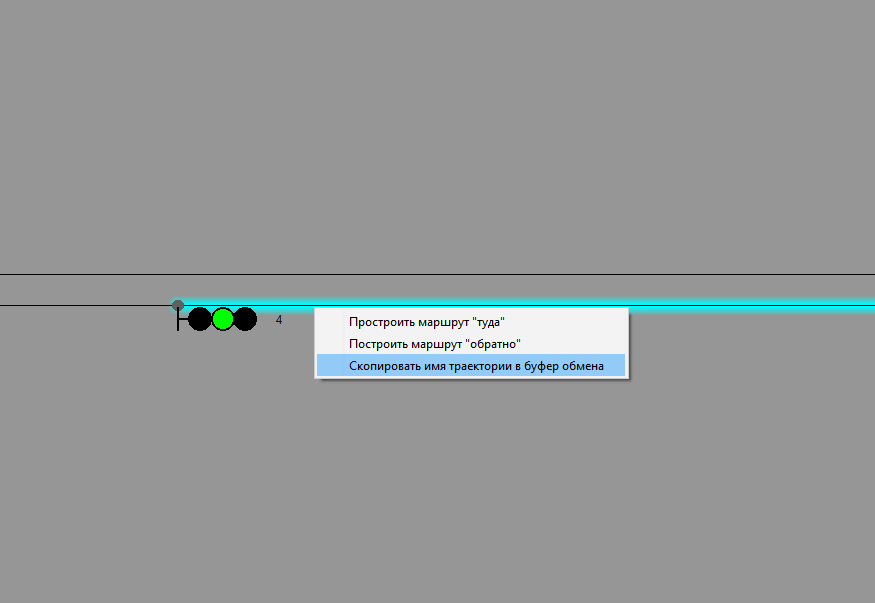
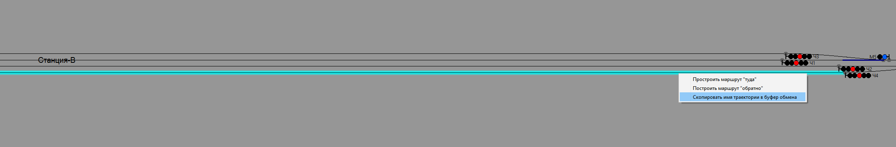
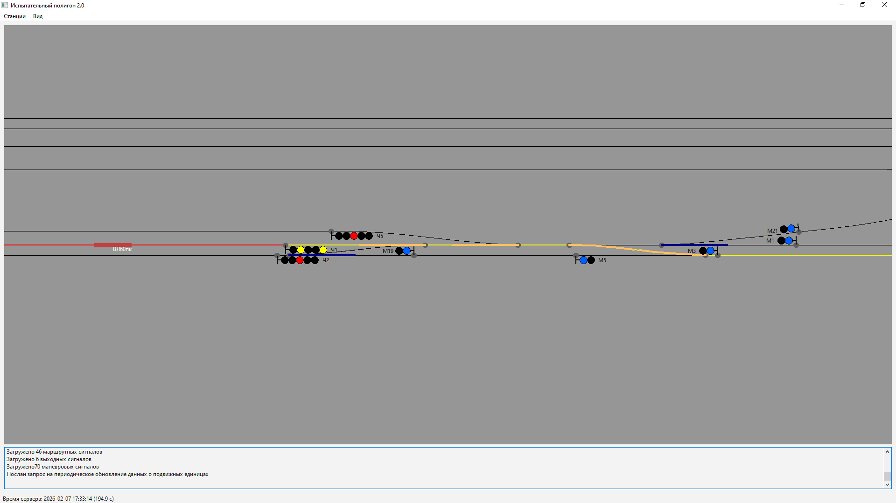
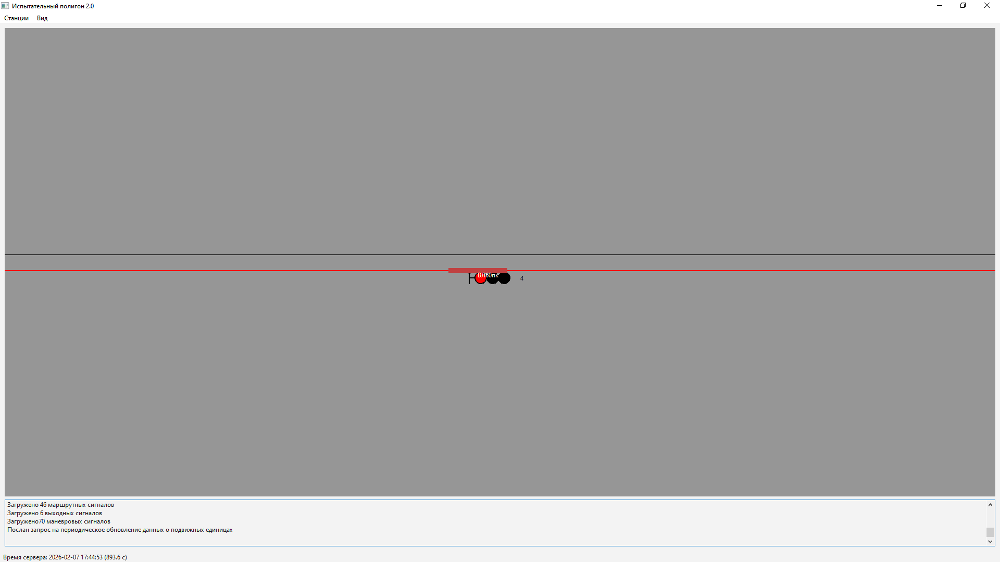
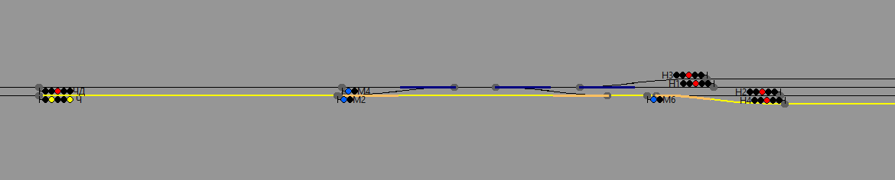
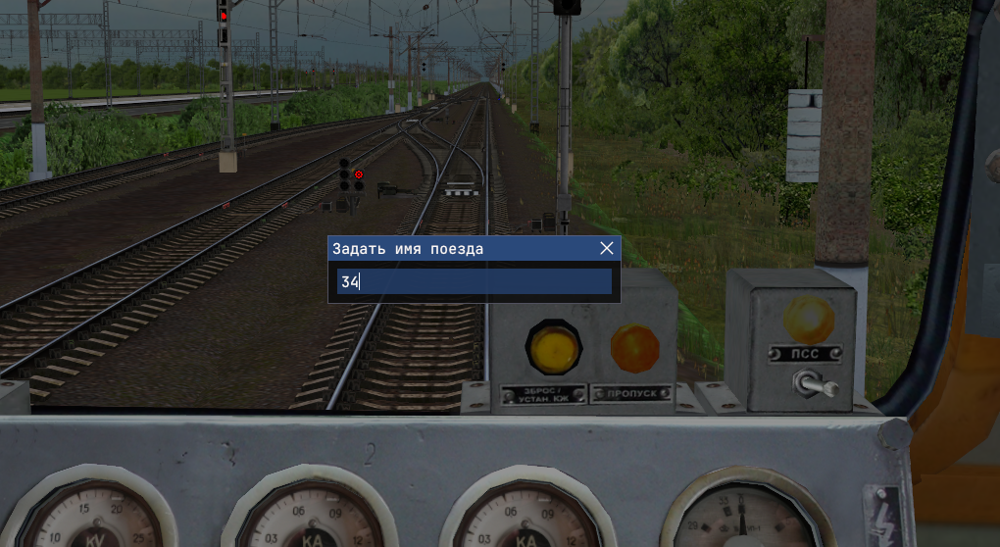
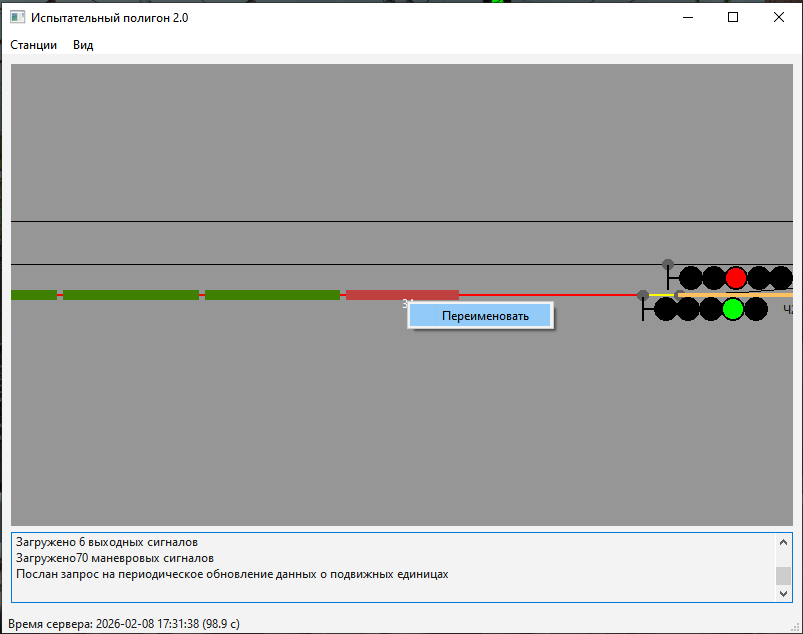
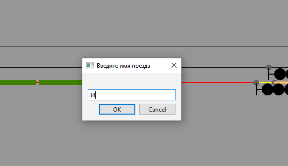

## 3. Более сложные команды сценариев. Позиционные триггеры

Выполнять произвольные действия в заданное время - это очень полезная функция. Но некоторые события крайне трудно, или вовсе невозможно привязать к заданному времени.

В прошлой главе мы строили маршрут отправления для одного единственного поезда. Это действие логично привязать ко времени. А как быть с маршрутом прибытия? Ведь наш поезд, хоть он и должен ехать по графику, может и не успеть подъехать к станции в заданное время. Он может приехать вовремя, но может приехать позже, или приехать раньше. Как быть?

Для того, чтобы ответить на этот вопрос, нам нужно поставить себя на место дежурного по железнодорожной станции. Когда он начинает готовить маршрут для прибывающего поезда? Обычно, когда поезд появляется на втором участке приближения, то есть находится за два блок-участка до входного светофора.

Было бы хорошо, чтобы сценарий мог построить нам маршрут, когда наш поезд займет второй участок приближения. Можно ли это сделать в RRS? Разумеется!

Каждый раз, когда какой-либо поезд занимает или освобождает какую-либо траекторию, внутри игры генерируется событие "изменение состояния тректории". И мы можем создать для симулятора так называемый *позиционный триггер* который выполнит нужное нам действие, когда будет занята или освобождена интересующая нас траектория.

Движок игры предоставляет для этого очень гибкие механизмы, но сначала мы рассмотрим простейшие.

### 3.1. Строим маршрут приема поезда

Итак, в прошлой главе мы отправили поезд на перегон. Допустим он почти достиг следующей станции, оказавшись на втором приближении к ней, то есть он занял блок участок за светофором 4.



Скопируем имя этой траектории в буфер обмена. Имя этой траектории "track_a-b_4-2". Когда поезд займет её, необходимо построить маршрут приема на следующую станцию, она у нас Станция В. Например на 4 боковой путь. Посмотрим на карте, как называется этот путь. 



Имя целевой траектории "track_b_p4". Отлично, теперь нужна начальная точка, откуда будет построен маршрут. В качестве нее может выступать та траектория, которую мы заняли, то есть "track_a-b_4-2".

Для установки маршрута создадим позиционный триггер такой командой

```
-- Строим маршрут приема на 4 путь станции В по факту занятия второго четного приближения
setOnTrajBusyTrigger("track_a-b_4-2", actionBuildTrainRoute("track_a-b_4-2", "track_b_p4", my_train.dir))
```

Это означает следующее: если занята траектория "track_a-b_4-2" необходимо выполнить действие, указанное в следующем параметре функции setOnTrajBusyTrigger(). В роли этого действия выступает стандартная, и уже знакомая нам функция actionBuildTrainRoute() (смотрите [главу 2](scenario-struct.md)), которая строит поездной маршрут от одной траектории до другой, в заданном направлении.

Обратите внимание, что вместо 1 или -1 мы указали направление, передав в action-функцию my_train.dir. Это логично - ведь мы уже задали для нашего поезда его начальное направление движения, и можем воспользоваться им, так как оно не менялось.

Таким образом как только наш поезд наедет на второй участок приближения, будет построен марут его приема на 4 путь станции В! 

Теперь текст нашего сценария выглядит так

```
--[[ 

Мой первый сценарий
для Russian Railway Simulator

]]

-- Задаем время начала игры
setTime("17:30")

-- Описываем поезд игрока
my_train = TrainData.new()
my_train.name = "ВЛ60пк"
my_train.config = "vl60pk-1543"
my_train.traj = "track_a_p1a"
my_train.coord = 1690.0
my_train.dir = 1 

-- Устанавливаем поезд игрока
setTrain(my_train)

-- Строим маршрут отправления в 17:31 с пути 1А станции А
setTimeTrigger("17:31", actionBuildTrainRoute("track_a_p1a", "track_a-b_nd-22", my_train.dir))

-- Строим маршрут приема на 4 путь станции В по факту занятия второго четного приближения
setOnTrajBusyTrigger("track_a-b_4-2", actionBuildTrainRoute("track_a-b_4-2", "track_b_p4", my_train.dir))
```

В 17:31 мы отправляемся и выходим на перегон.



Занимаем второй участок удаления со стороны четной горловины станции В



Нам строят маршрут прияма на 4 путь



Не важно, соблюдает наш поезд график или нет. Маршрут приема будет построен ровно тогда, когда будет занята траектория, указанная в функции установки триггера!

Не важно, какой длины наш поезд. Симулятор считает траекторию занятой, когда на неё въезжает голова поезда. Симулятор считает траекторию свободной только тогда, когда её покидает последняя единица подвижного состава, входящая в поезд. Все это автоматически учитывается игрой. Для сценариста предоставляется факт - траектория занята/траектория свободна. И на этот факт можно прикрепить совершенно произвольное действие.

### 3.2. Строим маршрут приема для конкретного поезда 

А если нам нужно построить конекртеный маршрут для конкретного поезда. Скажем скорый поезд 34 мы должны пропустить по второму главному пути? Для этого, нужен триггер, который построит маршрут по занятию участка приближения конкретным поездом.

Для начал вспомним, что у нашего поезда есть имя

```
my_train.name = "ВЛ60пк"
```

Присвоим ему имя "34"

```
my_train.name = "34"
```

Пменяем конфиг поезда, чтобы у нас были вагоны, например возьмем стандартный конфиг для пассажирского поезда из комплекта симулятора

```
my_train.config = "vl60pk-1543-T65_17"
```

Вообще, напишем другой сценарий, руководствуясь знаниями, полученными в [главе 2](scenario-struct.md). 

```
-- Задаем время начала игры
setTime("17:30")

-- Описываем поезд игрока
train34 = TrainData.new()
train34.name = "34"
train34.config = "vl60pk-1543-T65_17"
train34.traj = "track_a_p2b"
train34.coord = 1040.0
train34.dir = 1 

setTrain(train34)

-- Строим маршрут отправления в 17:31 с пути 2Б станции А
setTimeTrigger("17:31", actionBuildTrainRoute(tran34.traj, "track_a-b_nd-22", train34.dir))

-- Строим маршрут пропуска поезда 34 по 2 главному пути станции В
setOnTrajBusyByTrainTrigger("track_a-b_4-2", "34", actionBuildTrainRoute("track_a-b_4-2", "track_b-c_nd-22", train34.dir))
```

Тут важна функция setOnTrajBusyByTrainTrigger(). Первым параметром она задает ту траекторию, которую надо занять, а вторым - имя поезда, который должен это сделать. В качестве действия - построение сквозного маршрута по 2 пути станции В, конечная траектория которого - первый четный участок удаления (смотрим по карте!)

Обратите внимание и на то, что в качестве начальной траектории маршрута отправления мы указали не конктетное имя, а параметр структуры описывающей поезд train34.traj. Ведь мы уже задали ту траекторию, где находится поезд, нам незачем писать имя этой траектории повторно.

### 3.3. Имя поезда может измениться!

Как это? Да очень просто - в RRS это возможно. Например, когда вы начинаете игру на одиночном локомотиве, и собираетесь, совершив маневры по станции, прицепиться к составу. Тогда в начале игры у вас было два поезда, а после прицепки - будет один поезд.

В этом случае его имена обоих ранее существовавших поездов сбросятся и станут равны "0000". 

Аналогично - после отцепки от состава, у вас был один поезд, а станет  - два. Имя старого поезда будет сброшено, а состав и отцепившийся локомотив получат имя "0000".

Но сценарий должен точно знать имя поезда, как мы увидели из предыдущего примера. Как быть?

Да так же как и в жизни! Присвоить поезду нужное имя. 

Это можно сделать прямо в кабине локомотива. Нажмите F8. В появившемся окне введите новое имя (допускается латиница и цифры!) и нажмите Enter. поезд получит новое имя.



Это можно сделать из карты. Щелкните правой кнопкой по старому имени поезда и в выпавшем контекстном меню выберете "Переименовать". 



В появившемся диалоговом окне надо ввести новое имя, которое тут же отобразиться в карте



Если вы играете с друзьями, переименование поездов из карты может взять ваш товарищ по игре, играющий роль дежурного по станции или диспетчера.

**ВНИМАНИЕ!!!** Если ваш сценарий предусматривает выполнение маневров с прицепкой или отцепкой локомотива - предупредите игрока о том когда и какое имя нужно дать поезду или локомотиву! Это можно сделать в описании сценария в файле README.md.

Такая механика дает возможность заранее планировать действия в сценарии, какие бы маневры не совершались фактически.


