## 2. Структура сценария

### 2.1. Простейший сценарий

Любой сценарий пишется для конкретного маршрута в игре. Поэтому, естественным образом, все сценарии для конкретного маршрута должный располагаться в папке scenarios, расположенной в папке с маршрутом. Например, в состав игры входит маршрут "Испытательный полигон". Папка scenarios уже есть там

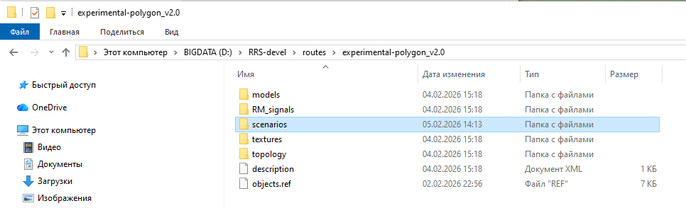


Если в том маршруте, для которого вы ведете разработку сценария, такой папки нет - создайте её!

В данной папке располагаются папки сценариев. Сценарий - это папка, содержащая файлы скриптов, файл описания, а в дальнейшем и звуковые файлы для озвучивания сценариев так же будут располагаться там.

Давайте создадим свой первый сценарий в RRS! Для примера будем использовать стандартный маршрут "Испытательный полигон".

Создадим в папке scenarios папку с именем сценария. Дадим ей имя hello_scenario

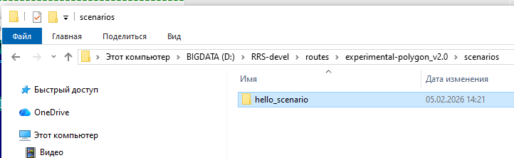

**ВНИМАНИЕ!!!** Избегайте использования в именах папок и файлов сценариев национальных алфавитов и пробельных символов! Несмотря на то, что такие имена поддерживаются как ОС Windows, так и, повидимому, движком Lua симулятора, неисключены проблемы при поиске и исполнении сценариев игрой! Только латиница, цифры, тире и подчеркивания.

Внутри этой папки создадим файл с именем main.lua


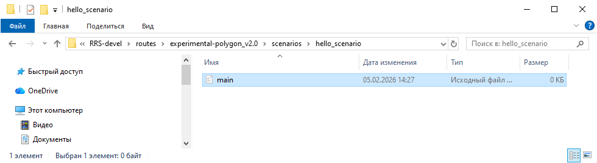

**ВНИМАНИЕ!!!** Файл с именем main.lua обязан присутствовать в сценарии! Это так называемый корневой или стартовый скрипт, с которого начинается исполнение сценария. Игра ожидает наличие этого файла! Расширение *.lua так же является обязательным!

Теперь мы можем написать простейший сценарий. Начнем с того, что дададим время, с которого начнется игра при запуске сценария. Пишем в файле main.lua

```
setTime("17:30")
```

Обратите внимание на синтаксис - время мы указываем в кавычках, так как, с точки зрения игры, астрономическое время это строка. Игра сама преобразует строку в игровое время.

Далее, нам нужно задать поезд, которым мы будем играть. Сделаем это, написав такой код скрипта

```
my_train = TrainData.new()
my_train.name = "ВЛ60пк"
my_train.config = "vl60pk-1543"
my_train.traj = "track_a_p1a"
my_train.coord = 1690.0
my_train.dir = 1

setTrain(my_train)
```

Давайте разберем эти "заклинания". my_train - это структура, которая хранит информацию о поезде и его начальном положении. Вы можете дать ей любое имя, но со следующими ограничениями

* имя содержит ТОЛЬКО латиницу!
* имя не должно начинаться с цифры! Цифры далее - разрешены
* пробелы - не допускаются, тире - не допускаются. Используйте вместо них символ подчеркивания "_"

Первая строка
```
my_train = TrainData.new()
```

содает в памяти игры структуру описания вашего поезда. TrainData - стандартное имя этой структуры. new() - оператор, который её создает

Далее
```
my_train.name = "ВЛ60пк"
```

Здесь мы задаем имя нашего поезда. Это строка, поэтому она указана в кавычках! Это имя в дальнейшем используется для идентификации нашего поезда в различных операциях, выполняемых в сценариях. 

**ВНИМАНИЕ!!!** Игра допускает здесь применение кирилических имен, как и в некоторых лругих случаях, которые мы оговорим позднее.


```
my_train.config = "vl60pk-1543"
```

Задаем имя конфига поезда. Эти конфиги лежат в игре в папке cfg/trains. Указанный конфиг - это электровоз ВЛ60пк резервом, вот он

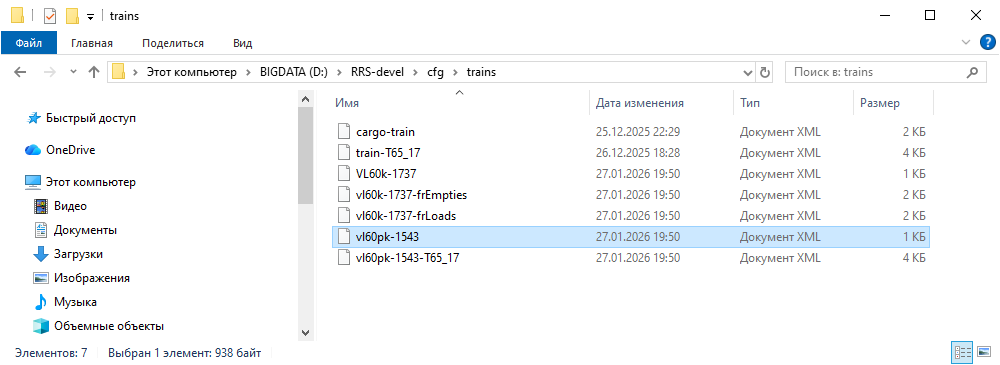

В игру будет загружен поезд, описанный данным конфигом.

Идем дальше
```
my_train.traj = "track_a_p1a"
```

Указываем имя траектории, на которой стоит поезд. Что такое траектория в RRS. Это непрерывный участок пути, разделенный стрелками или изолированными стыками, имеющий собственное имя. В данном случае - это путь 1А на Станции А испытательного полигона. В карте это выглядит так

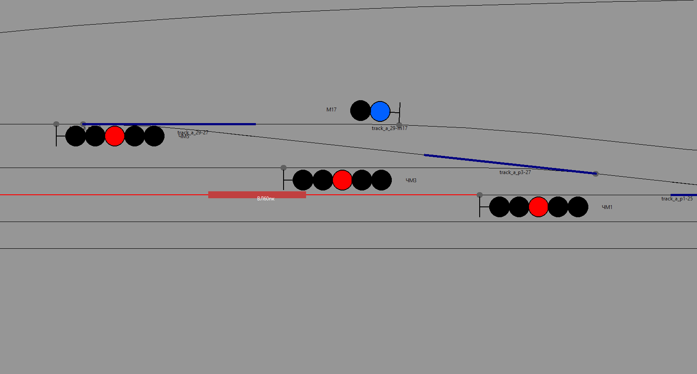

Как узнать имя траектории? Ну, во первых, если вы запустите игру в свободном режиме, без сценария, поставив любой поезд куда угодно, вы можете вывести в карте имена всех траекторий через меню "Вид -> Показать имена траекторий". И тогда вы увидете имя интересующей вас траектории, где-то в её середине. Вот так

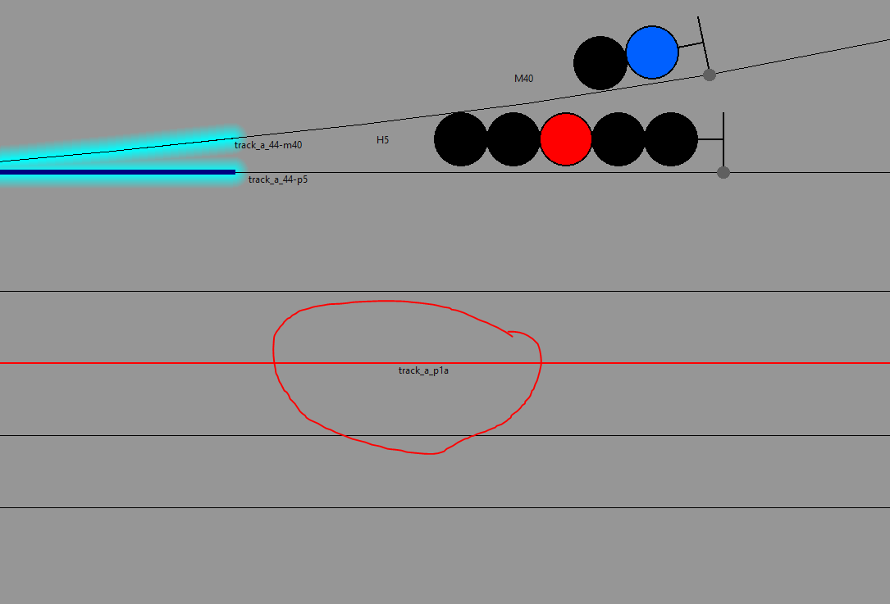

Но ползать по карте неудобно, искать имя долго. Есть другой способ получить имя интересующей траектории - выбрать ее наведя курсор и вызвать меню правой кнопкой

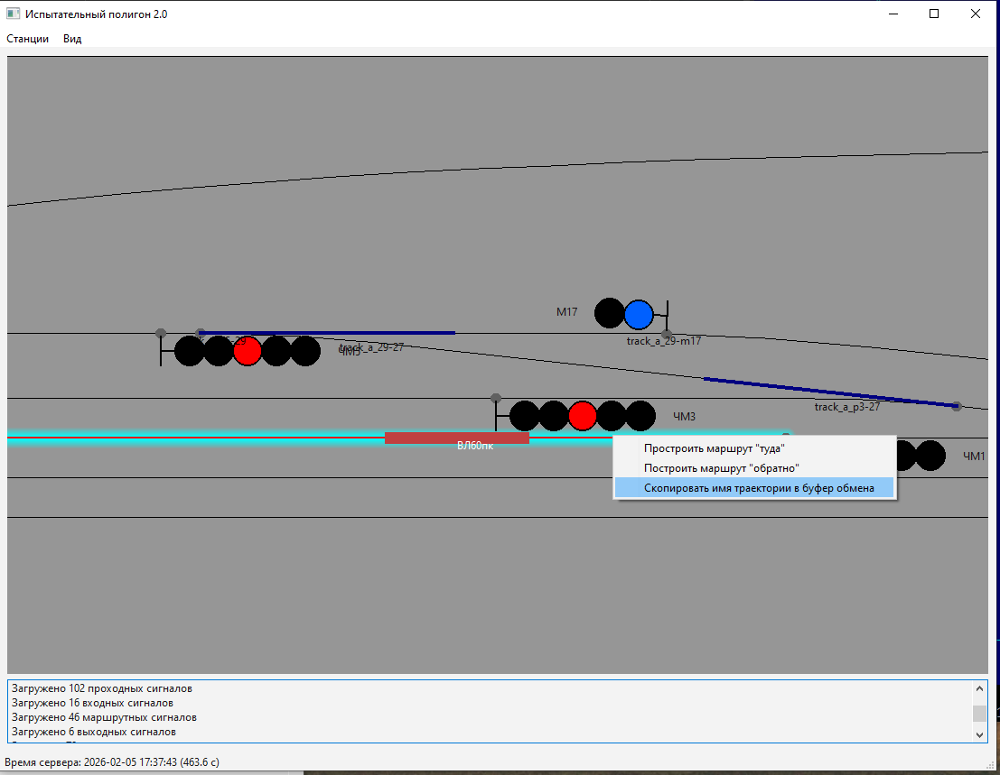

Имя нужной вам траектории будет скопировано в буфер обмена и в текст сценария вы его можете просто вставить (Ctrl + V / Shift + Insert)

Следующий параметр

```
my_train.coord = 1690.0
```
Координата головы поезда относительно начала траектории, в метрах. Этот параметр можно приблизительно оценить по карте. Другой способ, посмотреть конфиг topology/waypoints.conf разположенный в папке с маршрутом. Обычно он включает некоторые траектории на станциях, которые можно использовать в качестве точек старта из лаунчера. Внутри этого файла

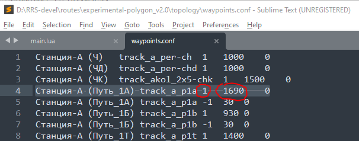

перечислены так называемые "путевые точки". Каждая строка включает в себя строку с названием станции и именем пути или выходного светофора с этого пути, имя траектории, направление (1 - в данном случае), и координатой вдоль траектриии. Последний параметр

```
my_train.dir = 1
```

направление головы поезда. В тарых терминах маршрутов ZDS 1 - "туда", -1 - "обратно". В терминах RRS - 1 - от начала траектории к концу, -1 - от конца траектории к началу.

Таким образом мы закончили описание поезда и следующей командной устанавливаем поезд в игру

```
setTrain(my_train)
```

Системная функция setTrain() принимает на вход структуру описания поезда.

Мы написали простейший игровой сценарий. Проверим его работу. Запускаем лаунчер игры (bin/launcer.exe). Выбераем маршрут и в выпадающем списке "Сценарии" видим наш hello_scenario. Выбираем его. 

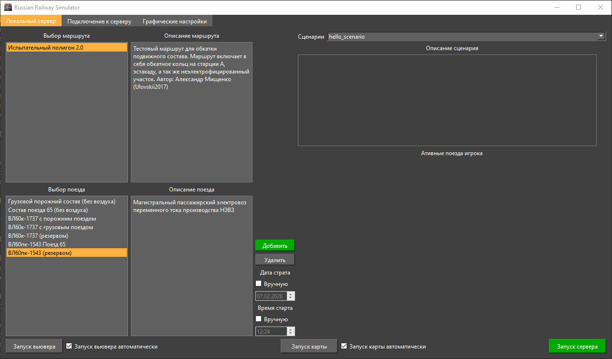

Жмем кнопку "Запуск серевера". Игра запустится и мы увидим наш поезд, стоящий там, где мы задали в сценарии.

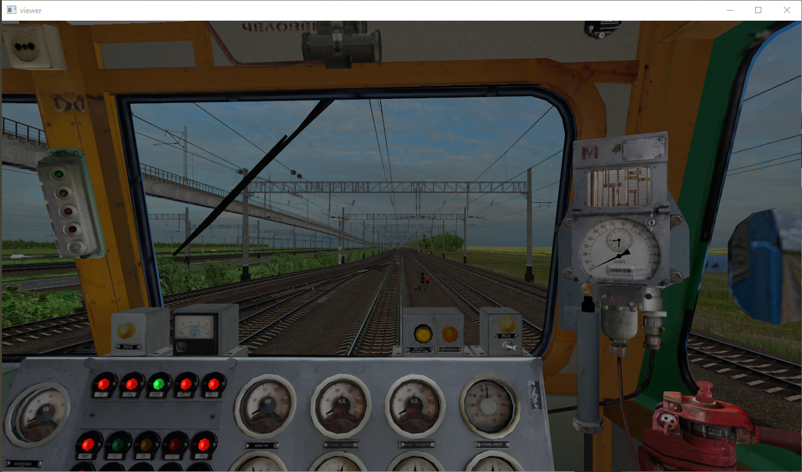

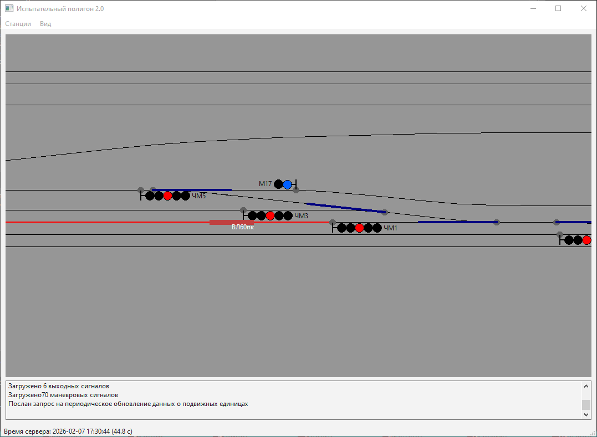

На игровых часах - заданное время, 17:30.

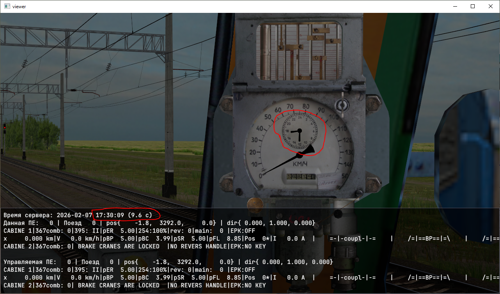


