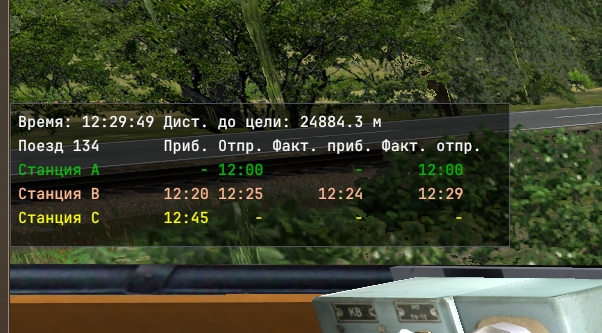

## 5. График движения поезда

Система сценариев симулятора была бы не полной без такого важного аспекта как возможность задавать график движения поезда. И в RRS имеется такая функциональность. График движения поезда в игре выполняет следующие функции:

1. Информирует игрока о маршруте следования поезда, с указанием станций, времени прибытия и отправления.
2. Отслеживает фактическое время прибытия и отправления поезда, с информированием игрока о соблюдении графика.
3. Обеспечивает автоматическое следования поезда по графику, если поезд находится в режиме "Автоведение" (параметр auto в [структуре TrainData](appendix4.md))
4. Обеспечивает автоматическое построение маршрутов приема/пропуска/отправления поезда по заданному пути станции.

Рассмотрим пример создания графика движения для сценария на маршруте "Испытательный полигон 2", входящий в комплект поставки игры.

### 5.1 Создание графика движения

Графики движения всех поездов в данном сценарии располагаются в папке со сценарием. Для размещения графика движения необходимо сосздать в папке сценария каталог timetable. Создадим сценарий, назвав его trains_134_135 и в главном файле main.lua напишем такую конфигурацию

**main.lua**
```
-- Время начала игры (важно!)
setTime("11:59")

-- Конфигурация поезда 134
train134 = TrainData.new()
train134.name = "134"
train134.config = "vl60pk-1543-T65_17"
train134.traj = "track_a_p2b"
train134.coord = 1040.0
train134.dir = 1
train134.auto = true 

setTrain(train134)

-- Конфигурация поезда 135
train135 = TrainData.new()
train135.name = "135"
train135.config = "vl60pk-1543-T65_17"
train135.traj = "track_c_p2"
train135.coord = 30.0
train135.dir = -1
train135.auto = true 

setTrain(train135)
```

В каталоге сценария создаем папку timetable - в ней будут хранится файлы графиков движения. Эти файлы имеют формат XML. 

**ВНИМАНИЕ!!! Имя файла должно совпадать с именем поезда!**

Например, для поезда с именем "134" имя графика движения будет 134.xml, а для поезда c именем "135" - 135.xml

**ВНИМАНИЕ!!! Файлы графиков движения должны сохраняться в кодировке UTF-8, принятой в симуляторе для всех текстовых данных! Используйте текстовый редактор с поддержкой сохранения файлов в данной кодировке.** 

Создадим в каталоге timetable файл 134.xml такого вида

**timetable/134.xml**
```
<?xml version="1.0" encoding="UTF-8"?>
<Config>

	<Station>
		<Name>Станция A</Name>			
		<DepartureTime>12:00</DepartureTime>
		<TargetTraj>track_a_p2b</TargetTraj>
		<TargetCoord>1040.0</TargetCoord>
		<RemovalTraj>track_a-b_nd-22</RemovalTraj>
	</Station>

	<Station>
		<Name>Станция B</Name>
		<ArrivalTime>12:20</ArrivalTime>			
		<DepartureTime>12:25</DepartureTime>
		<TargetTraj>track_b_p4</TargetTraj>
		<TargetCoord>1250.0</TargetCoord>
		<ApproachTraj>track_a-b_4-2</ApproachTraj>
		<RemovalTraj>track_b-c_nd-22</RemovalTraj>
	</Station>

	<Station>
		<Name>Станция C</Name>
		<ArrivalTime>12:45</ArrivalTime>			
		<TargetTraj>track_c_p3</TargetTraj>
		<TargetCoord>1250.0</TargetCoord>
		<ApproachTraj>track_b-c_4-2</ApproachTraj>			
	</Station>	
	
</Config>
```

Разберем этот файл подробнее. Он должен начинаться с шапки

```
<?xml version="1.0" encoding="UTF-8"?>
```

стандартной для всех XML-конфигов симулятора, и открывающего тега

```
<Config>
```

В конце файла обязан присутствовать закрывающий тег

```
</Config>
```

Между тегами Config располагается описание графика движения, которой состоит из секций с именем Station. Каждая секция описывает станцию, или произвольный пункт на маршруте, через должен проследовать поезд в заданное время. 

**ВНИМАНИЕ!!! Секции Station идут в порядке их расположения по ходу следования поезда!**

Разберем подробно секцию, которая описывает станцию B.

```
	<Station>
		<Name>Станция B</Name>
		<ArrivalTime>12:20</ArrivalTime>			
		<DepartureTime>12:25</DepartureTime>
		<TargetTraj>track_b_p4</TargetTraj>
		<TargetCoord>1250.0</TargetCoord>
		<ApproachTraj>track_a-b_4-2</ApproachTraj>
		<RemovalTraj>track_b-c_nd-22</RemovalTraj>
	</Station>
```

Эта секция включает ряд параметров

* Name - имя станции. Произвольное название, отображаемое в интерфейсе игры
* ArrivalTime - время прибытия на станцию по графику в формате hh:mm
* DepartureTime - время отправления со станции по графику.

Обращаю внимание на то, что если время прибытия совпадает с временем отправления, то поезд не будет останавливаться на станции, а проследует её без остановки. Однако, в таком случае **все равно должны быть явно указаны и время прибытия и время отправления!**

Для станции отправления, самой первой станции в графике, допускается не указывать время прибытия - по сценарию поезд уже будет находится на станции и симулятор считает его прибывшим в момент времени начала игры.

Для конечной станции, самой последней в графике, допускается не указывать время отправления. Если не указать время отправления, поезд останется на станции до конца игры. Перейдем к другим параметрам

* TargetTraj - траектория на которой поезд должен остановиться по графику, или которую он должен проследовать. В данном случае это путь 4 станции B ("track_b_p4").
* TargetCoord - координата точки остановки поезда в пределах траектории. Она находится в пределах от 0 до длины траектории. Изменяя эту координату, можно добиться, например остановки поезда в пределах платформы. При проследовании без остановки, поезд должен двигаться по данной траектории. Пересечение точки с указанной координатой фиксирует фактическое время отправления поезда со станции.
* ApproachTraj - имя траектории, которая является участком приближения к станции. Если указан данный параметр, то при занятии поездом этой траектории, будет автоматически построен маршрут приема поезда на путь, заданный параметром TargetTraj.
* RemovalTraj - имя траектории, которая является участком удаления от станции. Если указан этот параметр, то будет автоматически построен маршрут отправления поезда с пути TargetTraj через траекторию RemovalTraj.

**ВНИМАНИЕ!!!** Если указаны оба параметра: ApproachTraj и RemovalTraj - то при приближении поезда к станции будет автоматически построен маршрут на сквозной пропуск через путь TargetTraj. Поэтому, оба параметра рекомендуется задействовать именно при сквозном пропуске без стоянки, либо при небольшом времени стоянки. Если в течение времени стоянки предполагается построение других маршрутов через RemovalTraj, то этот параметр лучше не указывать, дабы не занимать СЦБ станции построенным заранее маршрутом. В этом случае, для отправления поезда с данной станции лучше прописать в сценарии временной триггер.

Кроме того, существует ряд параметров, необязательных для использования. 

* IsRightPlatform - наличие платформы справа от целевого пути. Принимает значения 1 или 0, обозначающие, соответсвенно наличие и отсутствие платформы справа. Указывает модулю автоведения на необходимость открыть правые двери вагонов (реализовано например в дизель-поезде РА-3).
* IsLeftPlatform - наличие платформы слева от целевого пути. Принимает значения 1 или 0, обозначающие, соответсвенно наличие и отсутствие платформы справа. Указывает модулю автоведения на необходимость открыть левые двери вагонов (реализовано в дизель-поезде РА-3).
* IsVisible - станция видна в виджете графика поезда. Этот параметр можно не указывать, тогда станция будет отображаться в виджете графика в симуляторе. Если станцию надо скрыть, можно в секции Station определить этот параметр как 0

```
	-- Станция не видна в виджете графика
	<IsVisible>0</IsVisible>
```


Такие скрытые точки графика можно использовать например для того, чтобы запланировать опоздание поезда. Для этого путевую точку можно разместить на перегоне, указав время проследования этой точки, или вообще остановки на заданное время. Например, в описанном выше графике можно задать такую путевую точку между станциями A и B

```
	<Station>
		<Name>Остановка на перегоне между A и B</Name>
		<ArrivalTime>12:10</ArrivalTime>			
		<DepartureTime>12:18</DepartureTime>
		<TargetTraj>track_a-b_8-6</TargetTraj>
		<TargetCoord>900.0</TargetCoord>
		<IsVisible>0</IsVisible>
	</Station>
```

В этом случае поезд, движущийся автоматически, будет ехать так, что прибудет в точку, расположенную через 900 метров после сигнальной точки 8 на перегоне между станциями в 12:10, остановится там, и простояв 8 минут отправится. При этом он почти наверняка опоздает с прибытием на станцию B по графику.

При этом данная точка не будет отображаться на графике движения.


Для справки можно использовать краткое описание формата графика в [приложении 5](appendix5.md)


### 5.2 Виджет отображения графика в интерфейсе симулятора

Если игра происходит по сценарию, и для данного поезда задан график движения, его можно отобразить на экране путем нажатия клавиши F7. Это выглядит так



Виджет отображает текущее время, расстояние до ближайшей по ходу движения станции, а так же перечень станций, с указанием времени прибытия и времени отправления по графику, а так же фактического времени прибытия и фактического времени отправления.

Проследованные поездом станции обозначаются цевтом: зеленым - в случае проследования по графику (+/- 2 минуты), оранжевым - в случае отклонения от графика на 3 минуты и более.

Желтой строкой обозначается станция-цель, к которой в данный момент движется поезд.

### 5.3 Загрузка графика в процессе игры


В [главе 3](position-triggers.md) мы рассматривали ситуацию, когда имя поезда может измениться. Это может произойти после сцепления локомотива с составом или после отцепки его от состава - появляется поезд, не существовавший в игре при старте.

Хотя имя поезда может быть любым, мы подразумеваем под именем поезда его номер, а номер всегда соотвествует графику. Что быдет если мы переименуем поезд?

Симулятор сбросит старый график и попытается найти новый график, в соотвествии с новым именем (номером) поезда. Если таковой график есть в каталоге timetable сценария, то он будет успешно загружен.

Пример переименования поезда в процессе исполнения сценария мы не рассматривали. Рассмотрим в этот раз. Пусть поезд едет от станции А до станции В по графику поезда 134, который мы привели выше, в на станции В меняет номер на 136. Создадим еще один график для поезда 136, в котором, для простоты, время прибытия на станцию В будет таким же как и в графике 134.

**timetable/136.xml**
```
<?xml version="1.0" encoding="UTF-8"?>
<Config>
	<Station>
		<Name>Станция A</Name>			
		<DepartureTime>12:00</DepartureTime>
		<TargetTraj>track_a_p2b</TargetTraj>
		<TargetCoord>1040.0</TargetCoord>
		<RemovalTraj>track_a-b_nd-22</RemovalTraj>
	</Station>

	<Station>
		<Name>Станция B</Name>
		<ArrivalTime>12:18</ArrivalTime>			
		<DepartureTime>12:28</DepartureTime>
		<TargetTraj>track_b_p4</TargetTraj>
		<TargetCoord>1250.0</TargetCoord>
		<ApproachTraj>track_a-b_4-2</ApproachTraj>
		<RemovalTraj>track_b-c_nd-22</RemovalTraj>
	</Station>

	<Station>
		<Name>Станция C</Name>
		<ArrivalTime>12:40</ArrivalTime>			
		<TargetTraj>track_c_p3</TargetTraj>
		<TargetCoord>1250.0</TargetCoord>
		<ApproachTraj>track_b-c_4-2</ApproachTraj>			
	</Station>	
</Config>
```

После станции В этот график отличается от графика 134. Сменим имя поезда на 136 в момент его прибытия на станцию В. Для этого напишем такой сценарий

**main.lua**
```
-- Задаем время
setTime("11:59")

-- Задаем поезд 134
train134 = TrainData.new()
train134.name = "134"
train134.config = "vl60pk-1543-T65_17"
train134.traj = "track_a_p2b"
train134.coord = 1040.0
train134.dir = 1
train134.auto = true 

setTrain(train134)

-- Меняем имя поезда с 134 на 136 в момент прибытия на станцию В
setTimeTrigger("12:20", actionRenameTrain(train134.name, "136"))
```